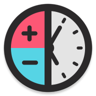

  

# Klock

> Time calculator

> Android

Free calculator to get the number of hours, minutes, and seconds between two times.

## Screenshots

  
  
  
  
  

## Privacy Policy

At Klock, we understand the importance of protecting the privacy of our users. That's why we have developed this privacy policy to explain how we collect, use, and share information about you when you use our mobile application.

First and foremost, we do not collect any personal data from our users. The app does not request access to any personal information or data from your device. It does not track your location or online activity. We do not ask for your name, email address, or any other identifying information.

We do not share any user data with third parties. We do not sell or rent your data to advertisers or other companies.

We take the protection of user privacy seriously and have implemented appropriate security measures to protect against the loss, misuse, and alteration of user data. However, it is important to remember that no security measures are perfect and we cannot guarantee the absolute security of your data.

We may update this privacy policy from time to time. If we make any changes, we will post the revised policy on this page and update the effective date at the top. We encourage you to review this policy periodically to stay informed about how we are protecting the personal information we collect.

If you have any questions or concerns about our privacy policy, please contact us.

Thank you for using Klock.

## License

> Read Only License

### You can:
- Clone or download the project
- Read the code using your eyeballs
- Build or run the project
- Try or test the project
- Understanding or learning the implementations of the project
- Store or delete the entire project in your own physical disk

### You can't:
- Make changes or modify the project
- Re-upload the project on the internet
- Re-submit the project to any market place
- Take screenshots from the project
- Copy & paste the files or code to any other project
- Print the code as a physical paper

> Copyright 2021 ©

## Available in:
Android: https://play.google.com/store/apps/details?id=com.slc.klock

## Contact
[![LinkedIn][linkedin-shield]][linkedin-url]

<!-- MARKDOWN LINKS & IMAGES -->
[license-shield]: https://img.shields.io/github/license/othneildrew/Best-README-Template.svg?style=flat-square
[license-url]: https://github.com/othneildrew/Best-README-Template/blob/master/LICENSE.txt
[linkedin-shield]: https://img.shields.io/badge/-LinkedIn-black.svg?style=flat-square&logo=linkedin&colorB=555
[linkedin-url]: https://www.linkedin.com/in/sergio-lopez-ceballos/
